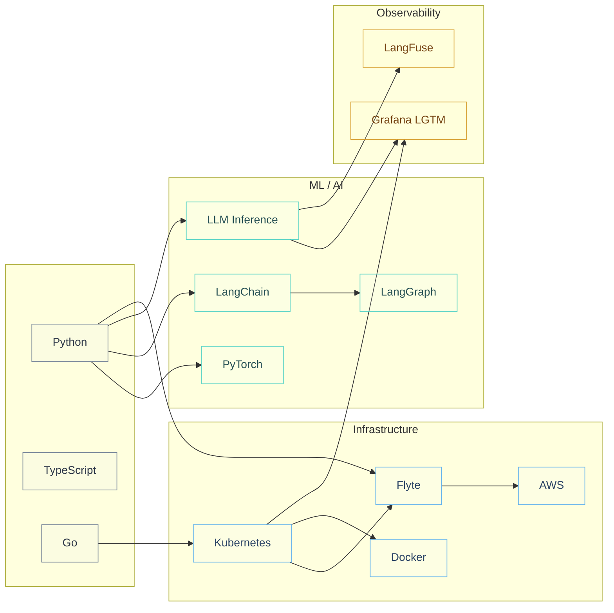

 

<table>
<tr>
<td width="55%" valign="top">

### about me

Software developer working in MLOps. I build ML platform infrastructure, work on inference pipelines, and spend a lot of time thinking about how to make AI systems reliable in production.

MS Computer Science @ **UIUC** · BS Statistics @ **Western**

When I'm not writing code, I'm under the hood of a project car.

</td>
<td width="45%" valign="top">

### right now

🔧 &nbsp; ML platform infra + model orchestration

🧠 &nbsp; LLM inference and serving at scale

🤖 &nbsp; Agentic AI systems and tooling

📡 &nbsp; Observability for ML workloads

</td>
</tr>
</table>

 

<table>
<tr>
<td width="33%" align="center" valign="top">

**inference**

`TRT-LLM` `Triton` `vLLM` `Dynamo`

</td>
<td width="33%" align="center" valign="top">

**orchestration**

`Kubernetes` `Flyte` `Docker` `AWS`

</td>
<td width="33%" align="center" valign="top">

**observability**

`Grafana LGTM` `LangFuse` `OpenLLMetry`

</td>
</tr>
<tr>
<td width="33%" align="center" valign="top">

**ml / ai**

`PyTorch` `LangChain` `LangGraph`

</td>
<td width="33%" align="center" valign="top">

**languages**

`Python` `Go` `TypeScript`

</td>
<td width="33%" align="center" valign="top">

**exploring**

`LLM eval at scale` `agent infra` `inference ops`

</td>
</tr>
</table>

 

### how it connects

 

 

<picture>
  <source media="(prefers-color-scheme: dark)" srcset="https://raw.githubusercontent.com/AmmarAlzureiqi/AmmarAlzureiqi/output/github-snake-dark.svg" />
  <source media="(prefers-color-scheme: light)" srcset="https://raw.githubusercontent.com/AmmarAlzureiqi/AmmarAlzureiqi/output/github-snake.svg" />
  
</picture>

 

[alzureiqi.dev](https://alzureiqi.dev) · [LinkedIn](https://linkedin.com/in/AmmarAlzureiqi) · [alzureiqi3@gmail.com](mailto:alzureiqi3@gmail.com)

