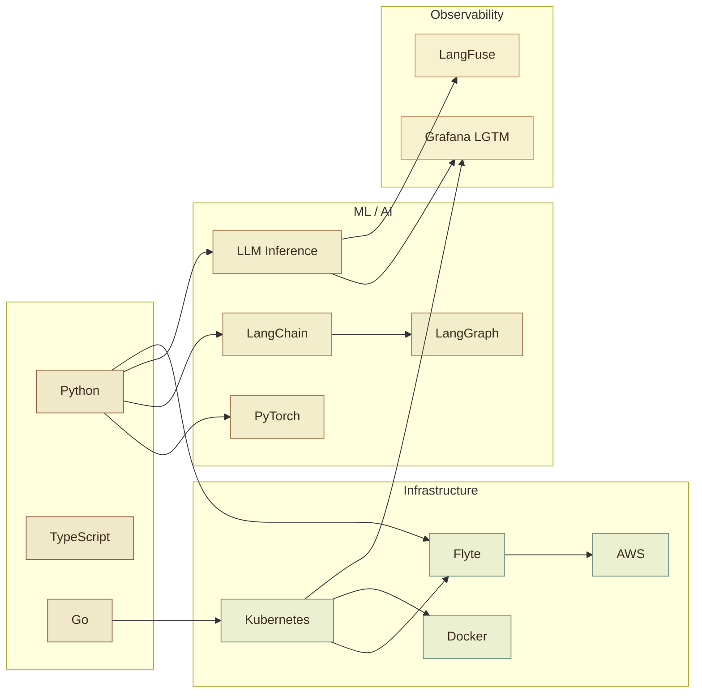

<div align="center">

[](https://alzureiqi.dev)

</div>

<br>

<table>
<tr>
<td>

**Ammar Alzureiqi**

Software developer, MLOps. Building ML platform infra by day, tinkering with inference and agents by night.

UIUC (MS CS) · Western (BS Stats)

</td>
<td>

```
currently:    LLM inference, agentic AI, ML platforms
learning:     TRT-LLM, Triton, vLLM, Dynamo
interested:   LLM eval at scale, agent infra, inference ops
languages:    Python, Go, TypeScript
```

</td>
</tr>
</table>

---



<details>
<summary>full toolbox</summary>
<br>

| | |
|:--|:--|
| **Inference** | TRT-LLM, Triton, Dynamo, vLLM |
| **ML / AI** | PyTorch, LangChain, LangGraph |
| **Orchestration** | Kubernetes, Flyte, Docker |
| **Observability** | Grafana LGTM, LangFuse, OpenLLMetry |
| **Cloud** | AWS |
| **Data** | PostgreSQL, ChromaDB |

</details>

---

<div align="center">


</div>

---

<div align="center">

<picture>
  <source media="(prefers-color-scheme: dark)" srcset="https://raw.githubusercontent.com/AmmarAlzureiqi/AmmarAlzureiqi/output/github-snake-dark.svg" />
  <source media="(prefers-color-scheme: light)" srcset="https://raw.githubusercontent.com/AmmarAlzureiqi/AmmarAlzureiqi/output/github-snake.svg" />
  
</picture>

</div>

---

<div align="center">

[alzureiqi.dev](https://alzureiqi.dev) · [LinkedIn](https://linkedin.com/in/AmmarAlzureiqi) · [alzureiqi3@gmail.com](mailto:alzureiqi3@gmail.com)

</div>

<!-- If you're reading the source, try the Konami code on the site. Or press ⌘K. -->
